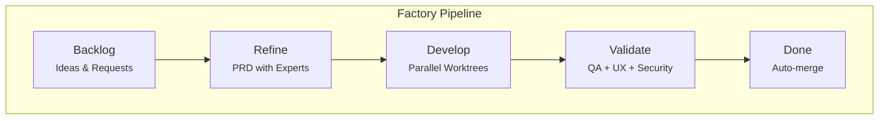
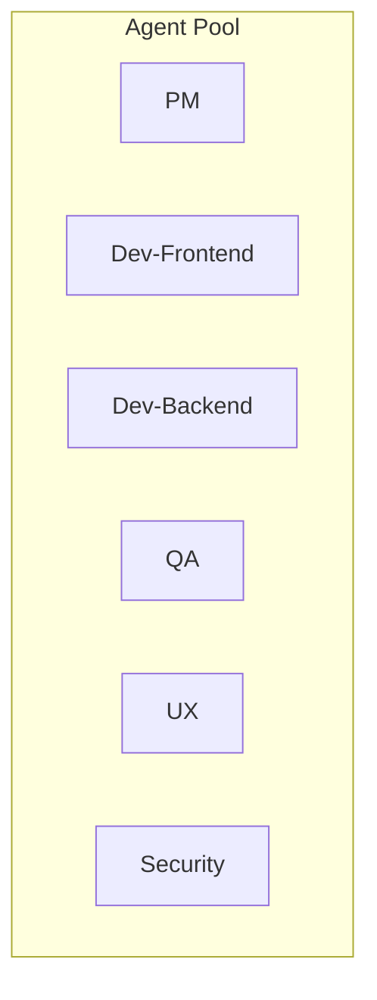
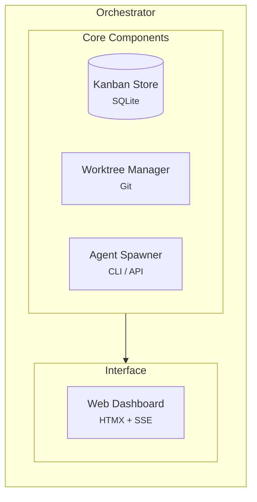
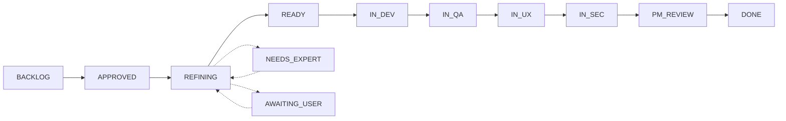

<h1 align="center">
  Factory
</h1>

<p align="center">
  <strong>An AI-powered development pipeline orchestrator that coordinates autonomous agents to build software through a kanban workflow.</strong>
</p>

<p align="center">
  <a href="https://github.com/madhatter5501/Factory/actions/workflows/ci.yml">
    
  </a>
  <a href="https://goreportcard.com/report/github.com/madhatter5501/Factory">
    
  </a>
  <a href="https://github.com/madhatter5501/Factory/releases">
    
  </a>
  <a href="https://github.com/madhatter5501/Factory/blob/main/LICENSE">
    
  </a>
  <a href="https://go.dev/">
    
  </a>
</p>

<p align="center">
  <a href="#key-features">Key Features</a> •
  <a href="#how-it-works">How It Works</a> •
  <a href="#quick-start">Quick Start</a> •
  <a href="#installation">Installation</a> •
  <a href="#usage">Usage</a> •
  <a href="#configuration">Configuration</a> •
  <a href="#architecture">Architecture</a> •
  <a href="#contributing">Contributing</a>
</p>

---

## Key Features

- **Autonomous Multi-Agent Orchestration** — Coordinates PM, Dev, QA, UX, and Security agents working in parallel
- **Kanban-Based Workflow** — Visual pipeline from ideation through development to deployment
- **Git Worktree Isolation** — Each ticket gets its own isolated development environment
- **Dual Execution Modes** — CLI mode via Claude CLI or API mode with prompt caching
- **Real-Time Web Dashboard** — Monitor progress with live SSE updates
- **Collaborative PRD Refinement** — Multi-round requirements gathering with domain experts
- **RAG-Enhanced Context** — Retrieval-augmented generation for codebase awareness
- **Zero External Dependencies** — Pure Go with embedded SQLite, no Docker required

## How It Works

Factory transforms software development into an automated assembly line:





### Agent Types

| Category | Agent | Responsibility |
|----------|-------|----------------|
| **Product** | PM | Creates iterations, reviews tickets, final approval |
| | PM-Requirements | Analyzes and refines requirements |
| | PM-Facilitator | Coordinates collaborative PRD discussions |
| | PM-Breakdown | Decomposes epics into actionable sub-tickets |
| **Development** | Dev-Frontend | Web/UI development (Lit, Vue, React) |
| | Dev-Backend | API/service development (.NET, Go) |
| | Dev-Infra | Infrastructure/DevOps (Azure, Docker) |
| **Quality** | QA | Test planning and execution |
| | UX | Design review and accessibility audit |
| | Security | Vulnerability assessment and remediation |

## Quick Start

```bash
# Clone the repository
git clone https://github.com/madhatter5501/Factory.git
cd Factory

# Build
make build

# Initialize a new project board
./bin/factory --repo=/path/to/your/project --init

# Start the web dashboard
./bin/factory --dashboard --port=8080

# Or run the full orchestrator
./bin/factory --repo=/path/to/your/project --with-dashboard
```

Open your browser to `http://localhost:8080` to access the dashboard.

## Installation

### Pre-built Binaries

Download the latest release for your platform from the [Releases](https://github.com/madhatter5501/Factory/releases) page.

```bash
# Linux (amd64)
curl -LO https://github.com/madhatter5501/Factory/releases/latest/download/factory-linux-amd64
chmod +x factory-linux-amd64
sudo mv factory-linux-amd64 /usr/local/bin/factory

# macOS (Apple Silicon)
curl -LO https://github.com/madhatter5501/Factory/releases/latest/download/factory-darwin-arm64
chmod +x factory-darwin-arm64
sudo mv factory-darwin-arm64 /usr/local/bin/factory

# macOS (Intel)
curl -LO https://github.com/madhatter5501/Factory/releases/latest/download/factory-darwin-amd64
chmod +x factory-darwin-amd64
sudo mv factory-darwin-amd64 /usr/local/bin/factory
```

### Build from Source

**Requirements:**
- Go 1.24 or later
- Git

```bash
git clone https://github.com/madhatter5501/Factory.git
cd Factory
make build
```

The binary will be available at `./bin/factory`.

## Usage

### Command Line Interface

```
factory [options]

Options:
  --repo           Target repository path (default: current directory)
  --bare-repo      Bare repository path for local-only workflow
  --max-agents     Maximum parallel agents (default: 3)
  --timeout        Agent execution timeout (default: 30m)
  --interval       Orchestration cycle interval (default: 10s)
  --auto-merge     Automatically merge completed tickets
  --dry-run        Preview mode - no agents spawned
  --verbose        Enable verbose logging (default: true)
  --version        Display version information

Dashboard:
  --init           Initialize a new kanban board
  --status         Display board status
  --dashboard      Launch web dashboard only
  --with-dashboard Run orchestrator with embedded dashboard
  --port           Dashboard port (default: 8080)
  --db             Database path (default: factory.db)
```

### Examples

```bash
# Initialize and run with dashboard
factory --repo=./my-project --init --with-dashboard

# Run in dry-run mode to preview actions
factory --repo=./my-project --dry-run --verbose

# High-throughput mode with more parallel agents
factory --repo=./my-project --max-agents=5 --auto-merge

# Dashboard-only mode for monitoring
factory --dashboard --port=3000 --db=./data/factory.db
```

## Configuration

### Environment Variables

| Variable | Required | Description |
|----------|----------|-------------|
| `ANTHROPIC_API_KEY` | For API mode | Anthropic API key for direct API calls with prompt caching |

### Execution Modes

Factory supports two execution modes for AI agents:

| Mode | Trigger | Description |
|------|---------|-------------|
| **CLI Mode** | No API key | Spawns `claude` CLI tool for each agent |
| **API Mode** | API key present | Direct API calls with prompt caching for efficiency |

API mode is recommended for production use as it provides:
- 90% cost reduction through prompt caching
- Faster response times
- Better rate limit handling

### Database

Factory uses SQLite for persistent storage. The database schema includes:

- `tickets` — Kanban tickets with properties and state
- `ticket_history` — Complete status change audit trail
- `agent_runs` — Record of all agent executions with metrics
- `config` — Key-value configuration storage

## Architecture

### Project Structure

```
Factory/
├── cmd/factory/           # CLI entry point
├── agents/                # Agent spawning infrastructure
│   ├── anthropic/         # Anthropic API client
│   ├── provider/          # Multi-provider abstraction
│   └── rag/               # Retrieval-augmented generation
├── git/                   # Git worktree management
├── internal/
│   ├── db/                # SQLite storage layer
│   └── web/               # HTTP dashboard server
│       ├── templates/     # HTML templates (HTMX)
│       └── static/        # CSS/JS assets
├── kanban/                # State types and transitions
├── prompts/               # Agent prompt templates
│   └── experts/           # Domain expert prompts
└── docs/                  # Design documentation
```

### Component Overview



### Kanban Workflow



| Status | Description |
|--------|-------------|
| `BACKLOG` | Unprocessed ideas awaiting review |
| `APPROVED` | Approved for development, pending requirements |
| `REFINING_ROUND_N` | PM analyzing with domain experts |
| `NEEDS_EXPERT` | Requires specific domain consultation |
| `AWAITING_USER` | Blocked on user decision |
| `READY` | Requirements complete, queued for development |
| `IN_DEV` | Active development by assigned agent |
| `IN_QA` | Quality assurance testing |
| `IN_UX` | User experience review |
| `IN_SEC` | Security audit |
| `PM_REVIEW` | Final PM sign-off |
| `DONE` | Completed and merged |
| `BLOCKED` | External dependency blocking progress |

## Development

### Prerequisites

- Go 1.24+
- Make
- golangci-lint (optional, for linting)

### Building

```bash
make build          # Build binary
make test           # Run tests
make lint           # Run linter
make fmt            # Format code
make clean          # Clean artifacts
```

### Testing

```bash
# Run all tests
go test -v ./...

# Run with coverage
go test -v -coverprofile=coverage.out ./...
go tool cover -html=coverage.out

# Run specific test
go test -v -run TestOrchestrator ./...
```

### Code Quality

The project uses `golangci-lint` with a comprehensive set of linters. Run locally:

```bash
golangci-lint run
```

## Collaborative PRD Model

Factory supports multi-round collaborative PRD (Product Requirements Document) refinement:

1. **Ideation** — User submits initial concept via web wizard
2. **Facilitation** — PM-Facilitator coordinates expert discussion
3. **Expert Input** — Domain experts (Backend, Frontend, Data, Security) provide analysis
4. **Iteration** — Multiple refinement rounds until requirements converge
5. **Approval** — User reviews final PRD before implementation begins

This ensures requirements are thoroughly vetted before development resources are committed.

## Roadmap

- [ ] Multi-repository support
- [ ] GitHub/GitLab integration for PR creation
- [ ] Slack/Discord notifications
- [ ] Custom agent prompt templates
- [ ] Metrics dashboard and analytics
- [ ] Plugin system for custom agents

## Contributing

Contributions are welcome! Please read our [contributing guidelines](CONTRIBUTING.md) before submitting PRs.

1. Fork the repository
2. Create your feature branch (`git checkout -b feature/amazing-feature`)
3. Commit your changes (`git commit -m 'feat: add amazing feature'`)
4. Push to the branch (`git push origin feature/amazing-feature`)
5. Open a Pull Request

## License

This project is licensed under the MIT License - see the [LICENSE](LICENSE) file for details.

---

<p align="center">
  Built with Go and powered by AI
  <br>
  <a href="https://github.com/madhatter5501/Factory/issues">Report Bug</a>
  ·
  <a href="https://github.com/madhatter5501/Factory/issues">Request Feature</a>
</p>
